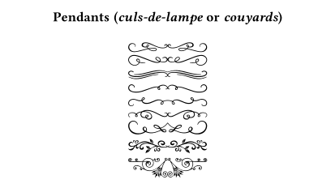

# couyards.sile

[](LICENSE)
[](https://github.com/Omikhleia/couyards.sile/actions?workflow=Luacheck)
[](https://luarocks.org/modules/Omikhleia/couyards.sile)

This package for the [SILE](https://github.com/sile-typesetter/sile) typesetting
system provides a few “couyards” ornaments, a.k.a. “culs-de-lampe” or, simply “pendants”.

Typographers of the past relied on a number of ornaments to make their books look nicer.

A _cul-de-lampe_ (plural _culs-de-lampe_) is a typographic ornament, sometimes called a
_pendant_, marking the end of a section of text. The term comes from French, for “bottom of
the lamp” (from the usual shape of the ornament). In French typography, they are also called
_couillards_ or _couyards_ (apparently named, erm… after a body part, really). It may be a
single illustration or assembled from fleurons.

The present package defines a few such ornaments, that book authors might possibly find
interesting to improve the look of their documents, without having to rely on single-character
fleurons provided in fonts.



Note that I am not the designers of the original artworks.
The first seven designs were converted to SVG from designs by [Tartila](https://fr.freepik.com/vecteurs-libre/diviseurs-fleurs-calligraphiques_10837974.htm), free for personal and commercial usage with proper attribution.
Number 8 and 9 are in the public domain (CC0), from [FreeSVG](https://freesvg.org).

## Installation

This package require SILE v0.14 or upper.

Installation relies on the **luarocks** package manager.

To install the latest development version, you may use the provided “rockspec”:

```
luarocks --lua-version 5.4 install --server=https://luarocks.org/dev couyards.sile
```

(Adapt to your version of Lua, if need be, and refer to the SILE manual for more
detailed 3rd-party package installation information.)
